# Hi, I'm Yevhen

I'm a Full Stack Developer / Site Reliability Engineer (SRE) with a strong background in DevSecOps. Currently working as a Senior DevSecOps at Big Company, I enjoy building secure, scalable, and efficient systems. I'm an active enthusiast who loves exploring new technologies and solving complex challenges through code and innovation.

## ⚡ Technologies

### Security Stack

## My Projects

- **OS[Samurai] Security Platform**  
  OS[Samurai] is a comprehensive security scanning platform that helps identify vulnerabilities in your code and infrastructure. The platform supports various types of scanning, including Static Application Security Testing (SAST), Software Composition Analysis (SCA), Dynamic Application Security Testing (DAST), and infrastructure analysis. Features role-based access control (RBAC) and an AI agent for report analysis.
  

  
View Screenshots

  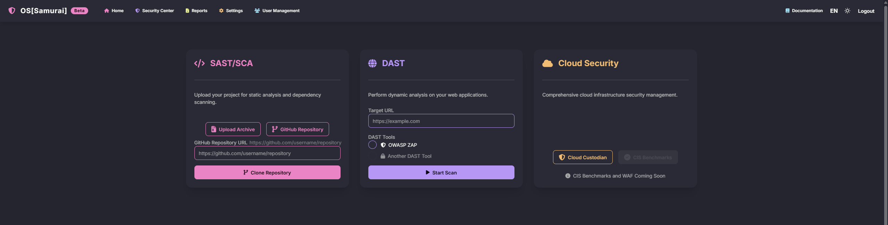
  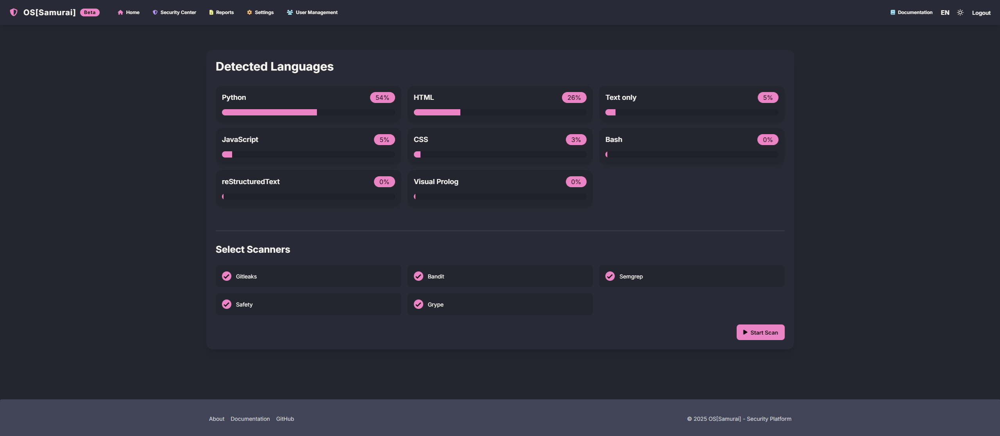
  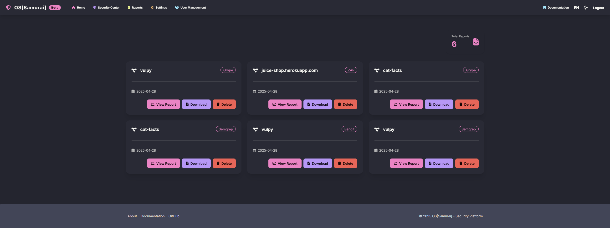
  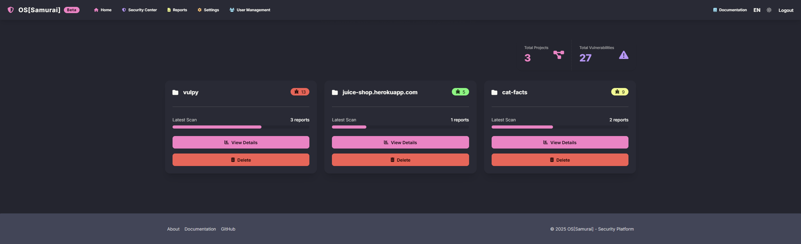
  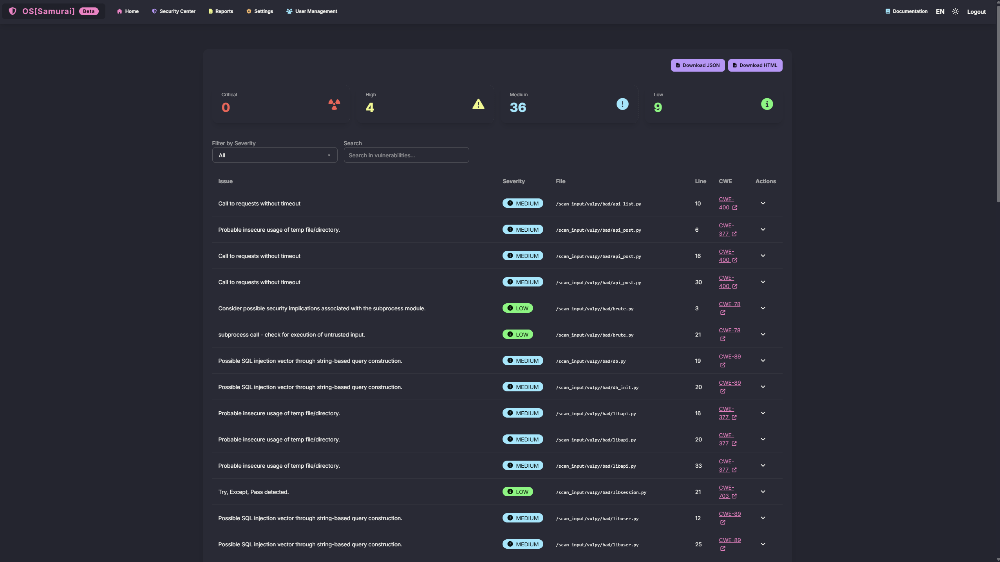
  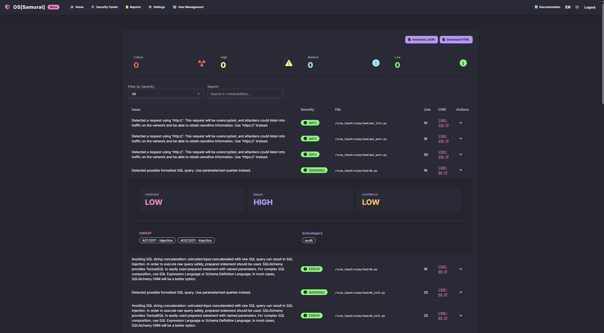
  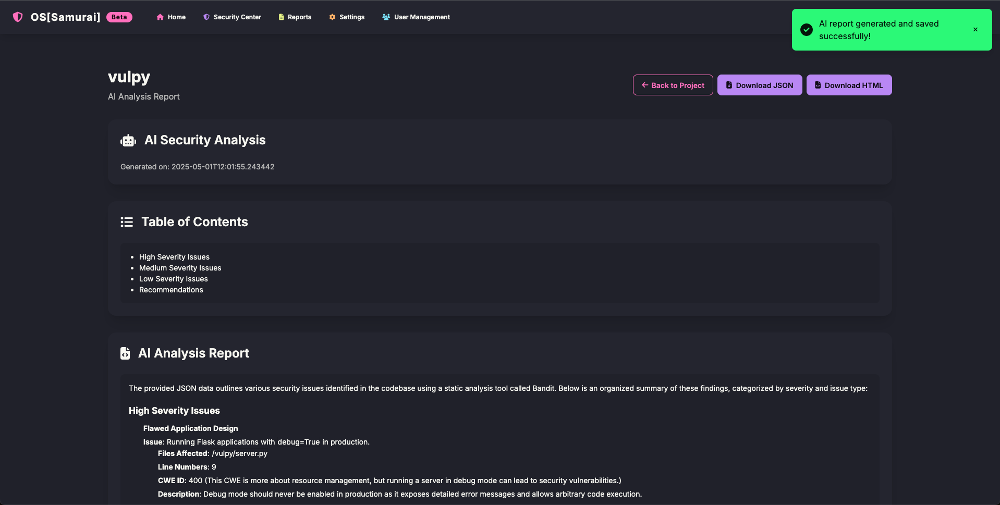
  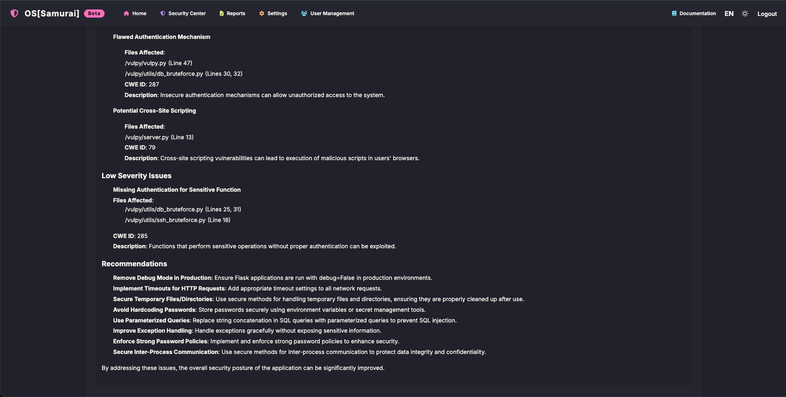
  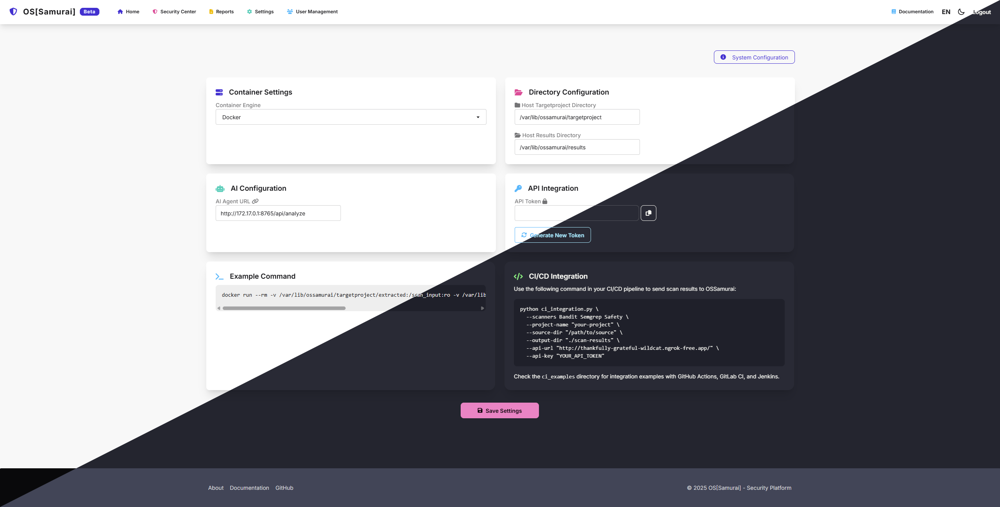
  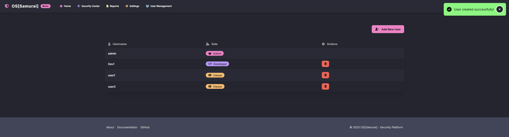
  

- **OS[Samurai] AI**  
  An AI-powered agent that scans security reports, performs deduplication, conducts analysis, and delivers actionable recommendations.  

- **MovieForFriends**
  A social movie platform inspired by IMDb, tailored for friends to rate, review, and discuss movies. Includes user profiles, movie suggestions, ratings, and more. Actively maintained with regular updates—check the repo for the latest features!  
  

  
View Screenshots

  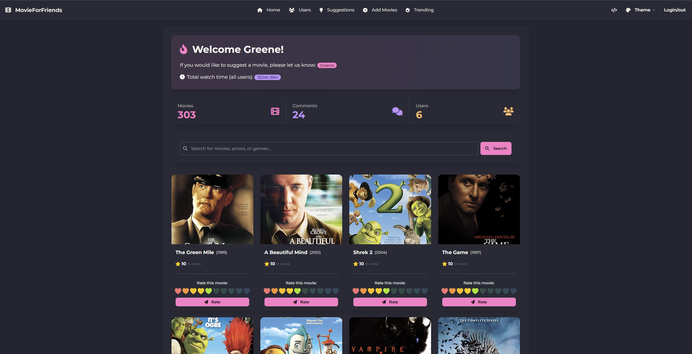
  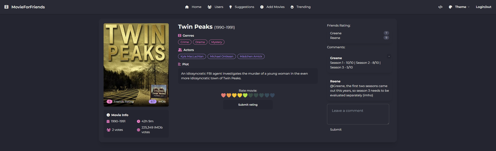
  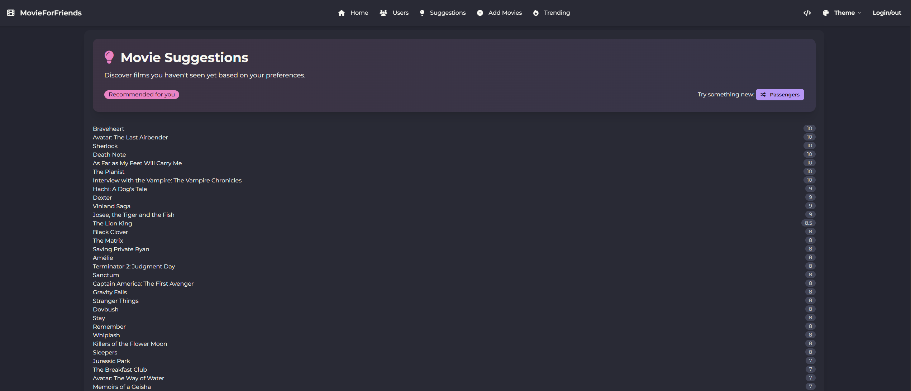
  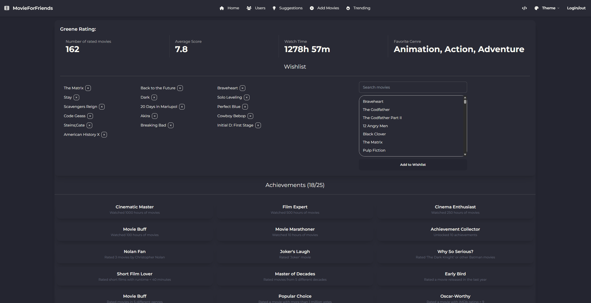
  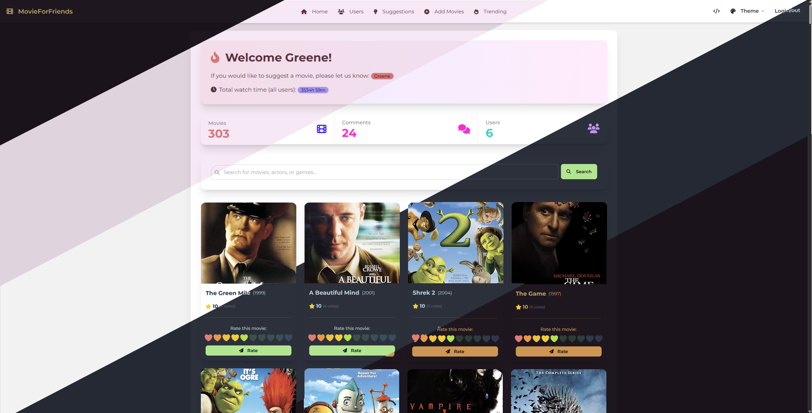
  

- **FileHorizon**
  A self-hosted alternative to Google Drive, designed for secure file storage and sharing.  
  

  
View Screenshots

  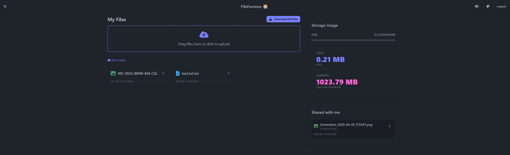
  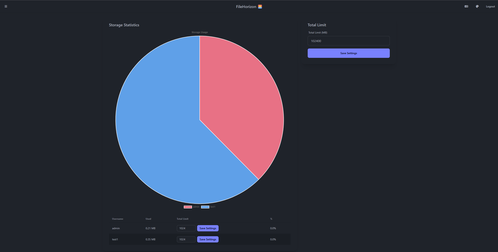
  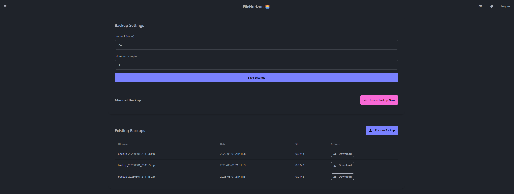
  

Don’t hesitate to reach out if you’d like to collaborate or chat with me!
